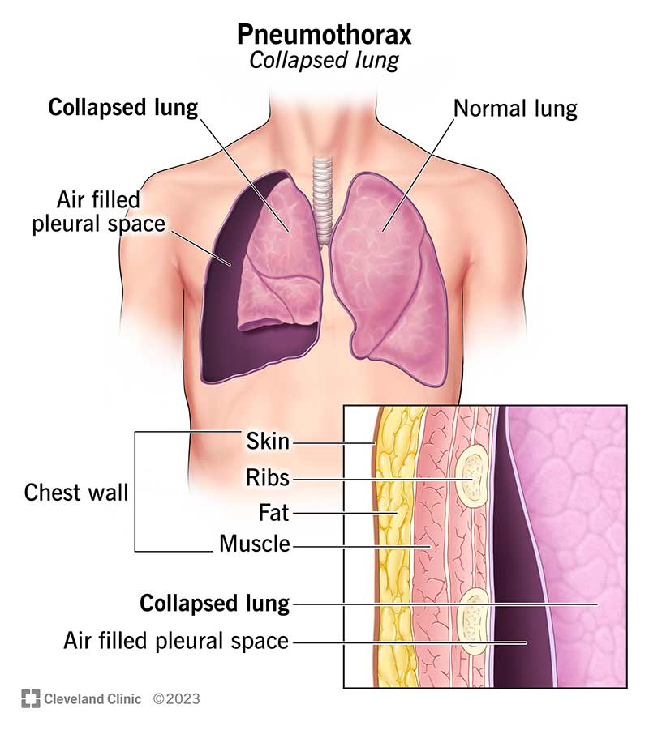
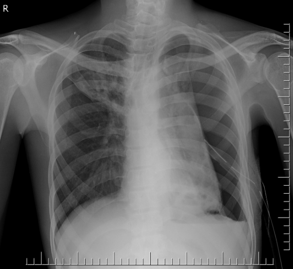
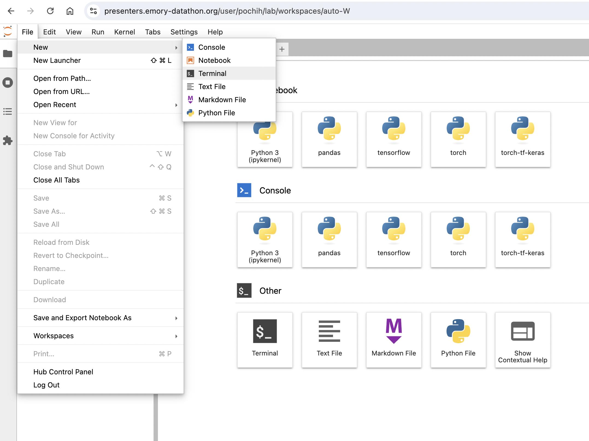
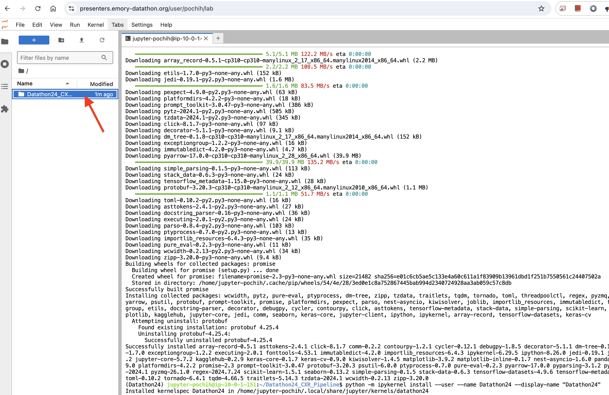
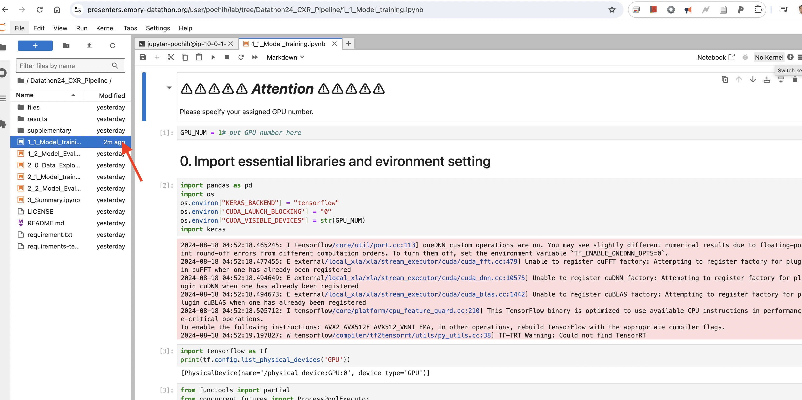
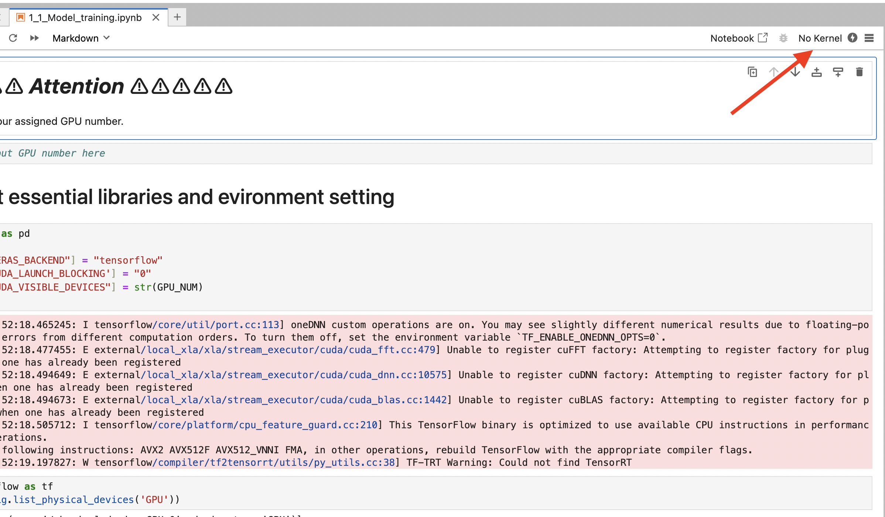
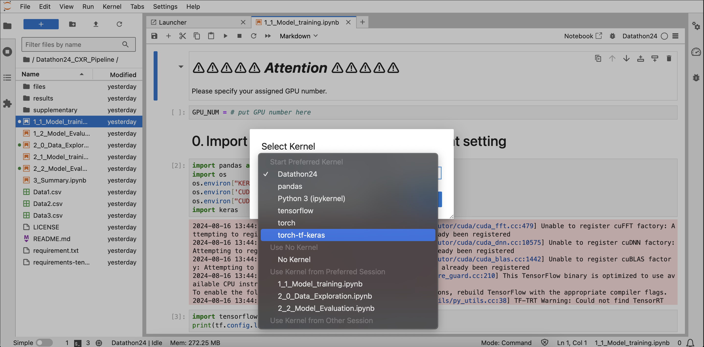

# Pneumothorax Classification using Deep Learning

This project implements a simple pipeline for training and evaluating a deep learning model to classify chest X-rays (CXRs) as positive or negative for pneumothorax. 

## 1. Pneumothorax Overview

A pneumothorax, commonly known as a collapsed lung, occurs when air enters the space between the chest wall and the lung (pleural space). This air accumulation can compress the lung, causing partial or complete collapse. Treatment typically involves air removal using a needle or chest tube inserted between the ribs.


*Reference: [Cleveland Clinic](https://my.clevelandclinic.org/health/diseases/15304-collapsed-lung-pneumothorax)*


*Reference: [Radiopaedia](https://radiopaedia.org/cases/27673?lang=us)*

## 2. Dataset

The project utilizes three subsets sampled from the Emory CXR dataset:

- **Data1**: 2,256 images for training
- **Data2**: 2,256 images for training
- **Data3**: 553 images for external validation

All images are frontal view chest X-rays, pre-processed by *resizing* and *padding*.

## 3. Deep Learning Framework: Keras

Keras is a high-level neural network API, designed for ease of use and rapid prototyping of deep learning models. We are going to use it with Tensorflow backend.

For more information: https://keras.io/getting_started/

## 4. Downloading the Codes

0. Go to terminal:

   

2. Navigate to home directory:
   ```
   cd ~
   ```

3. Clone the repository:
   ```
   git clone https://github.com/f10409/Datathon24_CXR_Pipeline.git
   ```
4. Navigate to the project folder:
   ```
   cd ~/Datathon24_CXR_Pipeline
   ```
5. Copy necessary files from FSX
   ```
   cp /fsx/embed/summer-school-24/Datathon24_SummerSchool_CXR/Data_Info/Data*.csv ./
   ```

## 5. Folder Sturcture

The project folder is organized as follows:

   1. **Jupyter Notebooks**: A series of notebooks prefixed with numbers (e.g., `1_1_Model_training.ipynb`, `1_2_Model_Evaluation.ipynb`). The numbers indicate the recommended execution order.

   2. **Dataset Information**: Three CSV files named `Data1.csv`, `Data2.csv`, and `Data3.csv`, containing metadata and labels for the respective datasets.

   3. **Results**: A directory named `results` where model evaluation outputs are stored.

   4. **Supplementary Material**: A folder named `supplementary` containing additional code and resources for those interested in deeper exploration of the project.
    
```
Datathon24_CXR_Pipeline/
│
├── 1_1_Model_training.ipynb
├── 1_2_Model_Evaluation.ipynb
├── 2_0_Data_Exploration.ipynb
│   ...
├── Data1.csv
├── Data2.csv
├── Data3.csv
│
├── results/
│   ├── Model1_External.csv
│   ├── Model1_TestSet.csv
│   └── ...
│
└── supplementary/
    ├── 1_a_Sample_biased_data.ipynb
    ├── 1_c_Preprocessing.ipynb
    └── ...
```

## 6. How to Open the Notebooks

1. Open notebook
    
    
2. Select Kernel
    
    

## 7. Environment Setup (Not Required!)

<u>If the existing enviroment doesn't have all the packages required</u>, you can create a virtual environment. 

To set up the project environment, follow these steps:


1. Create a new conda environment:
   ```
   conda create -y -n Datathon24 python=3.10
   ```
   
2. Configure Shell 
   ```
   conda init bash
   ```
3. Close the terminal and open it again

4. Activate the environment:
   ```
   conda activate Datathon24
   ```
   
5. Navigate to the project folder:
   ```
   cd ~/Datathon24_CXR_Pipeline
   ```

6. Install TensorFlow and CUDA dependencies:
   ```
   pip install -r requirements-tensorflow-cuda.txt
   ```

7. Install other project dependencies:
   ```
   pip install -r requirement.txt
   ```
   
8. Install a custom Jupyter kernel named "Datathon24". 
   ```
   python -m ipykernel install --user --name Datathon24 --display-name "Datathon24"
   ```
9. Restart the server


